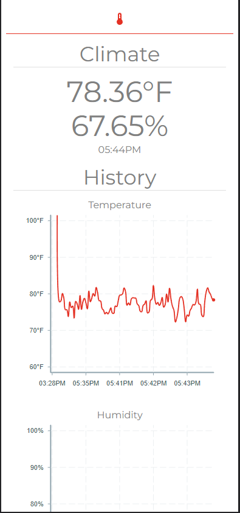
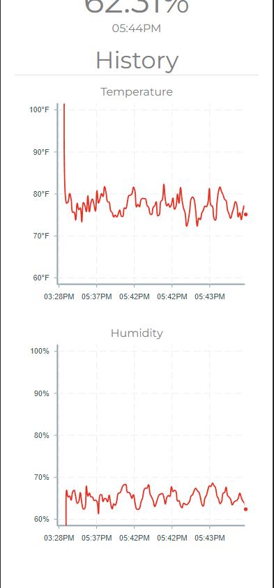
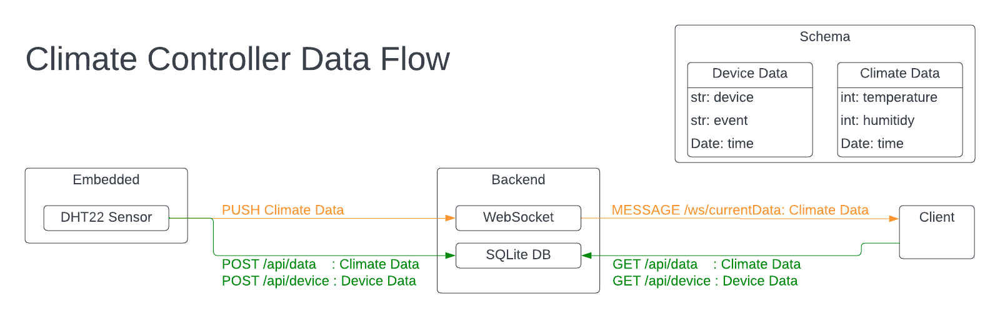

# Climate Controller

-   [Climate Controller](#climate-controller)
    -   [Overview](#overview)
    -   [Requirements](#requirements)
    -   [Installation](#installation)
        -   [Local Setup](#local-setup)
        -   [Raspberry Pi Setup](#raspberry-pi-setup)
    -   [Project Architecture](#project-architecture)
        -   [Embedded Components](#embedded-components)
        -   [Django Backend](#django-backend)
        -   [React Frontend](#react-frontend)

## Overview

This repository uses a Raspberry Pi Zero W to control and monitor the climate of a given environment. It includes a python-implemented embedded system, a React frontend, and a Django backend that implements both HTTP and WebSocket connections.

The Raspberry Pi will continuously read temperature and humidity information from a DHT22 sensor and publish that information to a websocket on the Django backend. The React frontend can connect to that websocket to read information in real time, and can publish GET requests to certain Django REST endpoints to receive past data over a specified period of time.

Below is a screenshot of the frontend application when the project is running:

    
    

## Requirements

To run this project, the only requirement is [docker](https://docs.docker.com/engine/install/). If deploying on a Raspberry Pi, the docker extension `buildx` is needed. BuildX is used to create multi-platform docker images.

To develop this project, the following are required:

-   [Python 3.9](https://www.python.org/downloads/release/python-3913/)
-   [pipenv](https://pipenv.pypa.io/en/latest/)
-   [redis-server](https://redis.io/docs/getting-started/)
-   Node.js v11
    -   Node v11 was the last Node version supported on armv6l devices (such as the RPi Zero). This can be easily installed using a version manager such as `nvm`.
-   `npm`
    -   Will be packaged with Node.

## Installation

### Local Setup

To run this project locally, navigate to the **scripts/** folder and run `./configure`. This will ask you for a username, email, and password for the Django instance and inject those variables into **.env** files throughout the project. Then, run `docker compose up` to start all required containers. The first time this is ran it will take some time as all images will need to be downloaded and built. Once all containers are running, visit [http://localhost:3000](http://localhost:3000) to see the application.

> **NOTE**
>
> To run this project without docker, visit the README file for the package you wish to run to see installation instructions.

### Raspberry Pi Setup

This explains how to initialize a Raspberry Pi to run the code in this repository.

> **NOTE**
>
> If you only want to run the code on your local machine you can skip this section.

1. Write the Raspberry OS 32-Bit (Debian/Bullseye) image to an SD card using [Raspberry Pi Imager](https://www.raspberrypi.com/software/).
    - Enable SSH, keep the username as "pi", and assign a password in the settings before writing the OS.
    - Click [here](https://downloads.raspberrypi.org/raspios_full_armhf/images/raspios_full_armhf-2022-09-26/2022-09-22-raspios-bullseye-armhf-full.img.xz) to download the image manually.
2. Insert the SD card into the Raspberry Pi and log into it via SSH using the username and password defined in step 1.
3. Clone this repository `git clone https://github.com/austinnebel/climate-controller`
4. Navigate into the **install/** directory and run `sudo bash install`. This will install all files and services onto the device. Once finished, the device will reboot.
5. Visit [http://localhost:3000](http://localhost:3000) to see the web application.

## Project Architecture

There are three main components to this project: the embedded, backend, and frontend code. Each of these are developed in entirely separate environments. This section provides an overiew of how each component works and how they communicate with eachother.

Below is a diagram the provides an overview of how data is transferred between each component:

    

### Embedded Components

> **NOTE**
> The documentation for the embedded project can be found [here](embedded/README.md).

The embedded project is designed to work with a Raspberry Pi Zero W, DHT22 sensor, GPIO relay, humidifier, heat lamp, and heating pad. The DHT22 sensor captures humidity and temperature data, and the GPIO relay provides or cuts power from the heat lamp, humidifier, and heating pad. The software in the embedded project takes the running average of readings from the DHT22 and uses the results to determine what devices to turn on or off. The project will also push this data to a websocket in the backend project and store data in the backend database.

### Django Backend

> **NOTE**
> The documentation for the backend can be found [here](backend/README.md).

The embedded package periodically pushes climate information to the Django backend. This data can both be saved in Django's SQLite database as well as published to a websocket channel. The websocket can be used to broadcast real-time data without bloating the database, while saving data to the database allows for reading past information over a period of time. The asynchronous websocket channels in Django are implemented by connecting to a [redis](https://redis.io/docs/getting-started/) instance.

### React Frontend

> **NOTE**
> The documentation for the frontend can be found [here](frontend/README.md).

The frontend service is designed to display real-time information about the climate data captured by the DHT22 sensor in the embedded project. This works by connecting to a Django websocket channel, as well as making GET requests the the REST endpoints in the backend. It displays the current temperature and humidity information via the websocket, and displays the last X amount of hours of this information in graphs via the REST endpoints.
